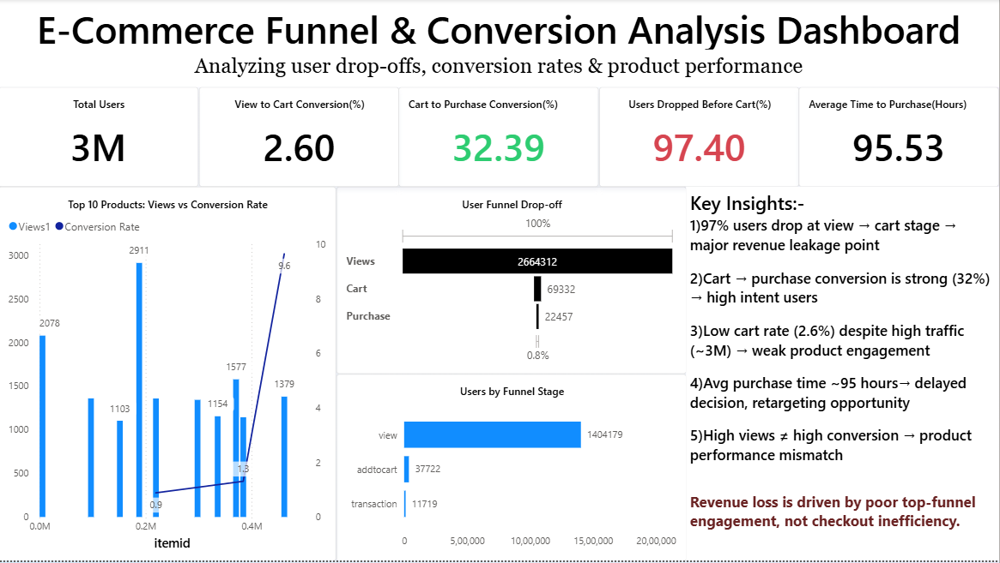

# 🛒 E-commerce Funnel & Conversion Analysis

## 🚀 Project Overview
This project analyzes user behavior across an e-commerce funnel to identify drop-offs, conversion rates, and revenue leakage. The objective is to transform raw event-level data into actionable business insights using SQL and Power BI.

---

## 🎯 Problem Statement
E-commerce platforms often experience high traffic but low conversions. This project aims to:
- Identify major drop-off points in the funnel  
- Analyze conversion rates across different stages  
- Understand user purchase behavior  
- Provide data-driven recommendations to improve revenue  

---

## 📊 Dataset Overview
- ~3 Million user interaction records  
- Event types:
  - Product View  
  - Add to Cart  
  - Purchase  

---

## ❓ Key Business Questions
- Where do users drop off in the funnel?  
- What are the conversion rates at each stage?  
- How long does it take users to complete a purchase?  
- Which products have high traffic but low conversion?  

---

## 📈 Key Insights

- 🚨 *97% users drop at the View → Cart stage* → major revenue leakage  
- ✅ *Cart → Purchase conversion (~32%) is strong* → high intent users  
- ⏱️ *Average purchase time ~95 hours* → delayed decision-making  
- ⚠️ *High traffic ≠ high conversion* → product performance mismatch  

---

## 💡 Business Recommendations

- Improve product page experience (UI/UX, pricing clarity, trust signals)  
- Use retargeting strategies for drop-off users  
- Focus on high-converting products  
- Optimize top-of-funnel engagement  

---

## 🛠️ Tools & Technologies

- SQL (Data Analysis & Querying)  
- Power BI (Dashboard & Visualization)  

---

## 📊 Dashboard Preview

---

## 📊 Power BI Dashboard File

🔗 [Download Dashboard (.pbix)](https://drive.google.com/file/d/1tX5bb7_d8_qfwD-RTCLrCbzzZonNJMEB/view?usp=sharing)

> Note: The dashboard file is hosted externally due to size limitations.

---

## 📄 Detailed Analysis Report

🔗 [View Full Report (Presentation)](https://docs.google.com/presentation/d/1cZ6gN_l0ilBYeTzUUDR3YlUvpjokTQ3j/edit?usp=sharing)

> Includes detailed SQL queries, analysis, and business insights.

---

## 🧠 Key Learnings

- Built an end-to-end funnel analysis project  
- Improved SQL querying and data manipulation skills  
- Developed business-focused dashboarding skills  
- Learned how to convert data into actionable insights
